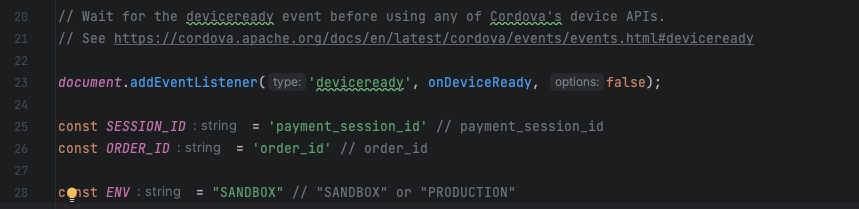

# Cashfree PG Cordova Demo App
This demo app illustrates integration of [cordova-plugin-cashfree-pg](https://www.npmjs.com/package/cordova-plugin-cashfree-pg).

## Environment
For setting up cordova environment refer [here](https://cordova.apache.org/docs/en/10.x/guide/cli/)

---

## Setup
Enter the following command in your shell.
### Step 1 (Clone the Repo)
```shell
git clone https://github.com/cashfree/cordova-plugin-cashfree.git
```
### Step 2 (Install dependencies)
```shell
cd example-cordova
npm install
cordova plugin add
```
### Step 3 (Sync project)
```shell
cordova prepare
```

---


## Configure the App
* navigate to <code>www/js</code> and open <code>index.js</code>
<p align="center">
  
</p>

* Replace <code>payment_session_id</code> and <code>order_id</code> with the 'payment_session_id' and 'order_id' received in response in order create api.

* Set the <code>ENV</code> as per the environment used for order create api ( <code>SANDBOX</code> or <code>PRODUCTION</code> ).

---

## Installing The App
### Android
To install the app in android run the following command.

```shell
cordova run android
```

### iOS
To install the app in iOS run the following command.

```shell
cordova run ios
```
